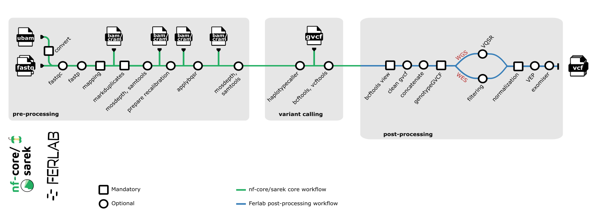

[](https://www.nf-test.com)

[](https://www.nextflow.io/)
[](https://www.docker.com/)
[](https://sylabs.io/docs/)

<!-- HIDDING BECAUSE NOT SUPPORTED YET
[](https://docs.conda.io/en/latest/)
-->

## Introduction

**Ferlab-Ste-Justine/Post-processing-Pipeline** is a bioinformatics pipeline designed for family-based analysis of GVCFs from multiple samples. 
It performs joint genotyping, tags low-quality variants, and optionally annotates the final vcf data using vep and/or prioritize variant using exomiser.

###  Summary:
1. Standardize input vcf files using bcftools view
2. Remove fake MNPs and duplicated positions using bcftools (optional)
3. Combine .gvcf
4. [Joint-genotyping](https://gatk.broadinstitute.org/hc/en-us/articles/360037057852-GenotypeGVCFs)
5. Tag false positive variants with either:
  - For whole genome sequencing data: [Variant quality score recalibration (VQSR)](https://gatk.broadinstitute.org/hc/en-us/articles/360036510892-VariantRecalibrator)
  - For whole exome sequencing data: [Hard-Filtering](https://gatk.broadinstitute.org/hc/en-us/articles/360036733451-VariantFiltration)
6. Normalize with bcftools
7. Optionnally annotate variants with [Variant effect predictor (VEP)](https://useast.ensembl.org/info/docs/tools/vep/index.html) and download reference cache (if not provided)
8. Optionnally integrate phenotype data to annotate, filter and prioritise variants likely to be disease-causing with [exomiser](https://www.sanger.ac.uk/tool/exomiser/)


### Workflow subway schema

The full Ferlab workflow is shown in the image below, including the steps applicable prior to this pipeline. The steps relevant to the Ferlab-Ste-Justine/Post-processing-Pipeline correspond to the post-processing block.


This schema was done using [inkscape](https://inkscape.org/) with the good pratices recommended by the nf-core community. See [nf-core Graphic Design](https://nf-co.re/docs/guidelines/graphic_design).

## Usage

Here is an example nextflow command to run the pipeline:

```bash
nextflow run -c cluster.config Ferlab-Ste-Justine/Post-processing-Pipeline -r "v2.7.0" \
    -params-file params.json  \
   --input samplesheet.csv \
   --outdir results/dir \
   --tools vep,exomiser
```

> [!NOTE]
> If you are new to nextflow and nf-core, please refer to [this page](https://nf-co.re/docs/usage/installation) on how to set-up nextflow.

> [!WARNING]
> Please provide pipeline parameters via the CLI or nextflow `-params-file` option. Custom config files including those provided by the `-c` nextflow option can be used to provide any configuration _**except for parameters**_;
> see [docs](https://nf-co.re/usage/configuration#custom-configuration-files).


For more details, see [docs/usage.md](docs/usage.md) and [docs/reference_data.md](docs/reference_data.md).


### Stub mode and quick tests

The `-stub` (or `-stub-run`) option can be added to run the "stub" block of processes instead of the "script" block. This can be helpful for testing.


To test your setup in stub mode, simply run `nextflow run Ferlab-Ste-Justine/Post-processing-Pipeline -profile test,docker -stub`. 

For tests with real data, see documentation in the [test configuration profile](conf/test.config)


Pipeline Output
-----
Path to output directory must be specified via the `outdir` parameter.

See [docs/output.md](docs/output.md) for more details about pipeline outputs.


## Credits

Ferlab-Ste-Justine/Post-processing-Pipeline was originally written by Damien Geneste, David Morais, Felix-Antoine Le Sieur, Jeremy Costanza, Lysiane Bouchard, Georgette Femerling.


## Contributions and Support

If you would like to contribute to this pipeline, please see the [contributing guidelines](.github/CONTRIBUTING.md).

Resources
-----
The documentation of the various tools used in this workflow are available here:

[Nextflow](https://www.nextflow.io/docs/latest/index.html)

[bcftools](https://samtools.github.io/bcftools/bcftools.html)

[igenomes](https://support.illumina.com/sequencing/sequencing_software/igenome.html)

**GATK**:
- [CombineGVCFs](https://gatk.broadinstitute.org/hc/en-us/articles/360037593911-CombineGVCFs)
- [GenotypeGVCFs](https://gatk.broadinstitute.org/hc/en-us/articles/360037057852-GenotypeGVCFs)
- [VariantRecalibrator](https://gatk.broadinstitute.org/hc/en-us/articles/360035531612-Variant-Quality-Score-Recalibration-VQSR)
- [VariantFiltration](https://gatk.broadinstitute.org/hc/enus/articles/360041850471-VariantFiltration)
- [HardFiltering](https://gatk.broadinstitute.org/hc/en-us/articles/360035531112--How-to-Filter-variants-either-with-VQSR-or-by-hard-filtering)

[VEP](https://useast.ensembl.org/info/docs/tools/vep/script/vep_options.html)

[EXOMISER](https://exomiser.readthedocs.io/en/latest/)


## Citations

This pipeline uses code and infrastructure developed and maintained by the [nf-core](https://nf-co.re) community, reused here under the [MIT license](https://github.com/nf-core/tools/blob/master/LICENSE).

> **The nf-core framework for community-curated bioinformatics pipelines.**
>
> Philip Ewels, Alexander Peltzer, Sven Fillinger, Harshil Patel, Johannes Alneberg, Andreas Wilm, Maxime Ulysse Garcia, Paolo Di Tommaso & Sven Nahnsen.
>
> _Nat Biotechnol._ 2020 Feb 13. doi: [10.1038/s41587-020-0439-x](https://dx.doi.org/10.1038/s41587-020-0439-x).
